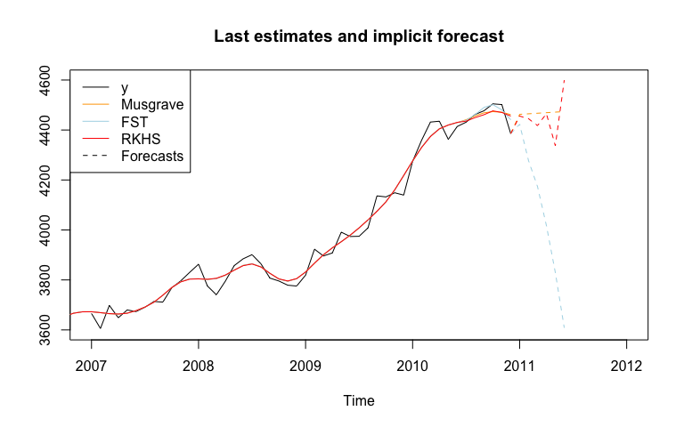
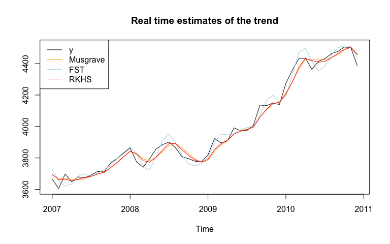

<!-- README.md is generated from README.Rmd. Please edit that file -->

# rjdfilters

rjdfilters is R package on linear filters for real-time trend-cycle
estimates. It allows to create symmetric and asymmetric moving averages
with:

-   local polynomial filters, as defined by Proietti and Luati (2008);

-   the FST approach of Grun-Rehomme, Guggemos, and Ladiray (2018),
    based on the optimization of the three criteria Fidelity, Smoothness
    and Timeliness;

-   the Reproducing Kernel Hilbert Space (RKHS) of Dagum and Bianconcini
    (2008).

Some quality criteria defined by Wildi and McElroy (2019) can also be
computed.

## Installation

rjdfilters relies on the
[rJava](https://CRAN.R-project.org/package=rJava) package and Java SE 8
or later version is required.

``` r
# Install development version from GitHub
# install.packages("devtools")
devtools::install_github("palatej/rjdfilters")
```

## Basic example

In this example we use the same symmetric moving average (Henderson),
but we use three different methods to compute asymmetric filters. As a
consequence, the filtered time series is the same, except at the
boundaries.

``` r
library(rjdfilters)
#> Java requirements fullfilled, found version 1.8.0_241
y <- window(retailsa$AllOtherGenMerchandiseStores,start = 2000)
musgrave <- lpp_properties(horizon = 6, kernel = "Henderson",endpoints = "LC")$filters.coef

# we put a large weight on the timeliness criteria
fst_notimeliness <- lapply(0:6, function(q) fstfilter(lags = 6, leads = q,
                                                      smoothness.weight = 1/1000,
                                                      timeliness.weight = 1-1/1000)$filter)
# RKHS filters minimizing timeliness
rkhs_timeliness <- rkhs_filter(horizon = 6, asymmetricCriterion = "Timeliness")$filters.coef

trend_musgrave <- jfilter(y, musgrave)
trend_fst <- jfilter(y, fst_notimeliness)
trend_rkhs <- jfilter(y, rkhs_timeliness)
plot(ts.union(y, trend_musgrave,trend_fst,trend_rkhs),plot.type = "single",
     col = c("black","orange", "lightblue", "red"),
     main = "Filtered time series", ylab=NULL)
```


The last estimates can also be analysed with the `implicit_forecast`
function that retreive the implicit forecasts corresponding to the
asymmetric filters (i.e. : the forecasts needed to have the same
end-points estimates but using the symmetric filter).

``` r
f_musgrave <- implicit_forecast(y, musgrave)
f_fst <- implicit_forecast(y, fst_notimeliness)
f_rkhs <- implicit_forecast(y, rkhs_timeliness)

plot(window(y, start = 2007),
     xlim = c(2007,2012), ylim = c(3600, 4600),
     main = "Last estimates and implicit forecast", ylab=NULL)
lines(trend_musgrave,
      col = "orange")
lines(trend_fst,
      col = "lightblue")
lines(trend_rkhs,
      col = "red")
lines(ts(c(tail(y,1), f_musgrave), frequency = frequency(y), start = end(y)),
      col = "orange", lty = 2)
lines(ts(c(tail(y,1), f_fst), frequency = frequency(y), start = end(y)),
      col = "lightblue", lty = 2)
lines(ts(c(tail(y,1), f_rkhs), frequency = frequency(y), start = end(y)),
      col = "red", lty = 2)
```



The real-time estimates (when no future points are available) can also
be compared:

``` r
trend_henderson<- jasym_filter(y, musgrave[,"q=6"], lags = 6)
trend_musgrave_q0 <- jasym_filter(y, musgrave[,1], lags = 6)
trend_fst_q0 <- jasym_filter(y, fst_notimeliness[[1]], lags = 6)
trend_rkhs_q0 <- jasym_filter(y, rkhs_timeliness[,1], lags = 6)
plot(window(ts.union(y, trend_musgrave_q0,trend_fst_q0,trend_rkhs_q0),
            start = 2007),
     plot.type = "single",
     col = c("black","orange", "lightblue", "red"),
     main = "Real time estimates of the trend", ylab=NULL)
```



## Bibliography

Grun-Rehomme, Michel, Fabien Guggemos, and Dominique Ladiray (2018).
“Asymmetric Moving Averages Minimizing Phase Shift”. In: *Handbook on
Seasonal Adjustment*. URL:
<https://ec.europa.eu/eurostat/web/products-manuals-and-guidelines/-/KS-GQ-18-001>.

Proietti, Tommaso and Alessandra Luati (Dec. 2008). “Real time
estimation in local polynomial regression, with application to
trend-cycle analysis”. In: *Ann. Appl. Stat.* 2.4, pp. 1523–1553. DOI:
10.1214/08-AOAS195. URL: <https://doi.org/10.1214/08-AOAS195>.

Wildi, Marc and Tucker McElroy (2019). “The trilemma between accuracy,
timeliness and smoothness in real-time signal extraction”. In:
*International Journal of Forecasting* 35.3, pp. 1072–1084. URL:
<https://EconPapers.repec.org/RePEc:eee:intfor:v:35:y:2019:i:3:p:1072->
1084.

Dagum, Estela Bee and Silvia Bianconcini (2008). “The Henderson Smoother
in Reproducing Kernel Hilbert Space”. In: *Journal of Business &
Economic Statistics 26*, pp. 536–545. URL:
<https://ideas.repec.org/a/bes/jnlbes/v26y2008p536-545.html>.
